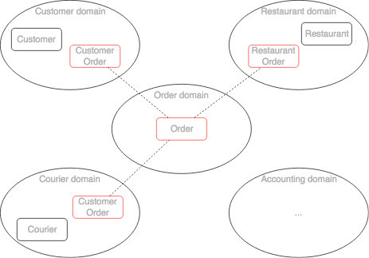
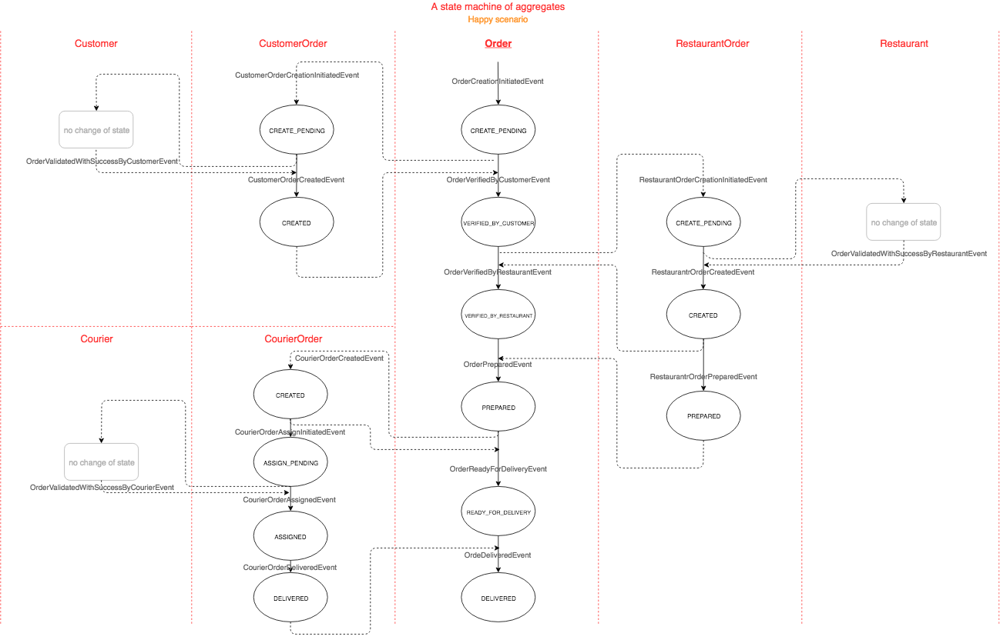

# [projects](http://idugalic.github.io/projects)/digital-restaurant [](https://travis-ci.org/idugalic/digital-restaurant)


Customers use the website application to place food orders at local restaurants. Application coordinates a network of couriers who deliver the orders.

*'d-restaurant-backend' is an example of an application that is built using Event Sourcing and CQRS. The application is written in Kotlin, and uses Spring Boot. It is built using Axonframework, which is an application framework based on event sourcing and CQRS.*

Note: Frontend part of the solution is available here [http://idugalic.github.io/digital-restaurant-angular](http://idugalic.github.io/digital-restaurant-angular/)

## Domain

*This layer contains information about the domain. This is the heart of the business software. The state of business objects is held here. Persistence of the business objects and possibly their state is delegated to the infrastructure layer*

Business capabilities of 'Digital Restaurant' include:
- [Courier component](https://github.com/idugalic/digital-restaurant/tree/master/drestaurant-libs/drestaurant-courier) 
  - Managing courier information
  - A courier view of an order (managing the delivery of orders)
- [Restaurant component](https://github.com/idugalic/digital-restaurant/tree/master/drestaurant-libs/drestaurant-restaurant)
  - Managing restaurant menus and other information including location and opening hours
  - A restaurant view of an order  (managing the preparation of orders at a restaurant kitchen)
- [Customer component](https://github.com/idugalic/digital-restaurant/tree/master/drestaurant-libs/drestaurant-customer)
  - Managing information about customers/consumers
  - A customer view of an order (managing the order-customer invariants, e.g order limits)
- [Order component](https://github.com/idugalic/digital-restaurant/tree/master/drestaurant-libs/drestaurant-order)
  - Order taking and fulfillment management
- [Accounting component](https://github.com/idugalic/digital-restaurant/tree/master/drestaurant-libs/drestaurant-accounting)
  - Consumer accounting - managing billing of consumers
  - Restaurant accounting - managing payments to restaurants 
  - Courier accounting - managing payments to couriers

As you try to model a larger domain, it gets progressively harder to build a single unified model for the entire enterprise. In such a model, there would be, for example, a single definition of each business entity such as customer, order etc. 
The problem with this kind of modeling is that:
 - getting different parts of an organization to agree on a single unified model is a monumental task. 
 - from the perspective of a given part of the organization, the model is overly complex for their needs. 
 - the domain model can be confusing since different parts of the organization might use either the same term for different concepts or different terms for the same concept. 

[Domain-driven design (DDD)](https://en.wikipedia.org/wiki/Domain-driven_design) avoids these problems by defining a separate domain model for each subdomain/component.

Subdomains are identified using the same approach as identifying business capabilities: analyze the business and identify the different areas of expertise. 
The end result is very likely to be subdomains that are similar to the business capabilities.
Each subdomain model belongs to one bounded context

- [Courier subdomain](https://github.com/idugalic/digital-restaurant/tree/master/drestaurant-libs/drestaurant-courier) 
- [Restaurant subdomain](https://github.com/idugalic/digital-restaurant/tree/master/drestaurant-libs/drestaurant-restaurant)
- [Customer subdomain](https://github.com/idugalic/digital-restaurant/tree/master/drestaurant-libs/drestaurant-customer)
- [Order subdomain](https://github.com/idugalic/digital-restaurant/tree/master/drestaurant-libs/drestaurant-order)
- [Accounting subdomain](https://github.com/idugalic/digital-restaurant/tree/master/drestaurant-libs/drestaurant-accounting)



The [Order](https://github.com/idugalic/digital-restaurant/tree/master/drestaurant-libs/drestaurant-order/src/main/kotlin/com/drestaurant/order/domain/Order.kt) ([RestaurantOrder](https://github.com/idugalic/digital-restaurant/tree/master/drestaurant-libs/drestaurant-restaurant/src/main/kotlin/com/drestaurant/restaurant/domain/RestaurantOrder.kt), [CustomerOrder](https://github.com/idugalic/digital-restaurant/tree/master/drestaurant-libs/drestaurant-customer/src/main/kotlin/com/drestaurant/customer/domain/CustomerOrder.kt), [CourierOrder](https://github.com/idugalic/digital-restaurant/tree/master/drestaurant-libs/drestaurant-courier/src/main/kotlin/com/drestaurant/courier/domain/CourierOrder.kt)) [aggregate](https://docs.axonframework.org/part-ii-domain-logic/command-model#aggregate) class in each subdomain model represent different term of the same 'Order' business concept.

The Restaurant component has a simpler view of an order aggregate (RestaurantOrder). Its version of an Order simply consist of a status and a list of line item, which tell the restaurant what to prepare. Additionally, we use event-driven mechanism called [sagas](https://docs.axonframework.org/part-ii-domain-logic/sagas) to [manage invariants between Restaurant aggregate and RestaurantOrder aggregate](https://github.com/idugalic/digital-restaurant/tree/master/drestaurant-libs/drestaurant-restaurant/src/main/kotlin/com/drestaurant/restaurant/domain/RestaurantOrderSaga.kt) (e.g. Restaurant order should have only menu items that are on the Restaurant menu)

The Courier component has a different view of an order aggregate (CourierOrder). Its version of an Order simply consist of a status and a address, which tell the courier how and where to deliver the order. Additionally, we use saga to [manage invariants between Courier aggregate and CourierOrder aggregate](https://github.com/idugalic/digital-restaurant/tree/master/drestaurant-libs/drestaurant-courier/src/main/kotlin/com/drestaurant/courier/domain/CourierOrderSaga.kt) (e.g. Courier can deliver a limited number of orders)

We must maintain consistency between these different 'order' aggregates in different components/domains. For example, once the Order component has initiated order creation it must trigger the creation of RestaurantOrder in the Restaurant component. We will [maintain consistency between components using sagas](https://github.com/idugalic/digital-restaurant/tree/master/drestaurant-libs/drestaurant-order/src/main/kotlin/com/drestaurant/order/domain/OrderSaga.kt).



We use [event sourcing](http://microservices.io/patterns/data/event-sourcing.html) to persist our [event sourced aggregates](https://docs.axonframework.org/part-ii-domain-logic/command-model#event-sourced-aggregates) as a sequence of events. Each event represents a state change of the aggregate. An application rebuild the current state of an aggregate by replaying the events.

Event sourcing has several important benefits:
 - It preserves the history of aggregates (100%), which is valuable for auditing and regulatory purposes
 - It reliably publishes domain events, which is particularly useful in a microservice architecture.
 - You can use any database technology to store the state.
 
Event sourcing also has drawbacks:
 - There is a learning curve because its a different way to write your business logic. 
 - Events will change shape over time.
 - Querying the event store is often difficult, which forces you to use the Command Query Responsibility Segragation (CQRS) pattern.

### Organisation vs encapsulation 

When you make all types in your application public, the packages are simply an organisation mechanism (a grouping, like folders) rather than being used for encapsulation. Since public types can be used from anywhere in a codebase, you can effectively ignore the packages.

The way Java types are placed into packages (components) can actually make a huge difference to how accessible (or inaccessible) those types can be when Java's access modifiers are applied appropriately. Bundling the types into a smaller number of packages allows for something a little more radical. Since there are fewer inter-package dependencies, you can start to restrict the access modifiers.
Kotlin language doesn't have 'package' modifer as Java has. It has 'internal' modifer which restricts accessiblity of the class to the whole module (compile unit, jar file...). This makes a difference, and you have more freedom to structure your source code, and provide good public API of the component.

For example, our [Customer component](https://github.com/idugalic/digital-restaurant/tree/master/drestaurant-libs/drestaurant-customer) classes are placed in one `com.drestaurant.customer.domain` package, with all classes marked as 'internal'.
Public classes are placed in `com.drestaurant.customer.domain.api` and they are forming an API for this component. This API consist of [commands](https://github.com/idugalic/digital-restaurant/tree/master/drestaurant-libs/drestaurant-customer/src/main/kotlin/com/drestaurant/customer/domain/api) and [events](https://github.com/idugalic/digital-restaurant/tree/master/drestaurant-libs/drestaurant-common/src/main/kotlin/com/drestaurant/customer/domain/api) only.

## Application

*This is a thin layer which coordinates the application activity. It does not contain business logic. It does not hold the state of the business objects*

### Monolith (REST by segregating Command and Query)

Sometimes, you are simply being required to deliver REST API :(

A recurring question with CQRS and EventSourcing is how to put a synchronous REST front-end on top of an async CQRS back-end.

In general there are two approaches:

 - segregating Command and Query
 - not segregating Command and Query
 
 This application is using second approach ('segregating Command and Query') by exposing capabilities of our 'domain' via the [REST API component](https://github.com/idugalic/digital-restaurant/tree/master/drestaurant-apps/drestaurant-monolith/src/main/kotlin/com/drestaurant/web) that is responsible for
 - dispatching commands - [CommandController](https://github.com/idugalic/digital-restaurant/tree/master/drestaurant-apps/drestaurant-monolith/src/main/kotlin/com/drestaurant/web/CommandController.kt)
 - querying the materialized views - [Spring REST repositories](https://github.com/idugalic/digital-restaurant/tree/master/drestaurant-apps/drestaurant-monolith/src/main/kotlin/com/drestaurant/query/repository)

[Event listener](https://github.com/idugalic/digital-restaurant/tree/master/drestaurant-apps/drestaurant-monolith/src/main/kotlin/com/drestaurant/query/handler) is a central component. It consumes events, and creates materialized views (projections) of aggregates.
This makes querying of event-sourced aggregates easy.

Aditonally, our event listener is publishing a WebSocket events on every update of materialized views. 
This can be usefull on the front-end to re-fetch the data via REST endpoints. 

#### 'Command' REST/HTTP API

##### 1. Create new Restaurant
```
curl -X POST --header 'Content-Type: application/json' --header 'Accept: */*' -d '{
  "menuItems": [
    {
      "id": "id1",
      "name": "name1",
      "price": 100
    }
  ],
  "name": "Fancy"
}' 'http://localhost:8080/api/command/restaurant/createcommand'
```
##### 2. Create/Register new Customer
```
curl -X POST --header 'Content-Type: application/json' --header 'Accept: */*' -d '{
  "firstName": "Ivan",
  "lastName": "Dugalic",
  "orderLimit": 1000
}' 'http://localhost:8080/api/command/customer/createcommand'
```
##### 3. Create/Hire new Courier
```
curl -X POST --header 'Content-Type: application/json' --header 'Accept: */*' -d '{
  "firstName": "John",
  "lastName": "Doe",
  "maxNumberOfActiveOrders": 20
}' 'http://localhost:8080/api/command/courier/createcommand'
```
##### 4. Create/Place the Order
```
curl -X POST --header 'Content-Type: application/json' --header 'Accept: */*' -d '{
  "customerId": "CUSTOMER_ID",
  "orderItems": [
    {
      "id": "id1",
      "name": "name1",
      "price": 100,
      "quantity": 0
    }
  ],
  "restaurantId": "RESTAURANT_ID"
}' 'http://localhost:8080/api/command/order/createcommand'
```
Note: Replace CUSTOMER_ID and RESTAURANT_ID with concrete values.

##### 5. Restaurant marks the Order as prepared
```
curl -X POST --header 'Content-Type: application/json' --header 'Accept: */*' 'http://localhost:8080/api/command/restaurant/order/RESTAURANT_ORDER_ID/markpreparedcommand'

```
Note: Replace RESTAURANT_ORDER_ID with concrete value.

##### 6. Courier takes/claims the Order that is ready for delivery (prepared)
```
curl -X POST --header 'Content-Type: application/json' --header 'Accept: */*' 'http://localhost:8080/api/command/courier/COURIER_ID/order/COURIER_ORDER_ID/assigncommand'

```
Note: Replace COURIER_ID and COURIER_ORDER_ID with concrete values.

##### 7. Courier marks the Order as delivered
```
curl -X POST --header 'Content-Type: application/json' --header 'Accept: */*' 'http://localhost:8080/api/command/courier/order/COURIER_ORDER_ID/markdeliveredcommand'

```


#### 'Query' REST/HTTP API
Application is using an event handler to subscribe to all interested domain events. Events are materialized in SQL database schema. 

REST API for browsing the materialized data:

```
curl http://localhost:8080/api/query
```

#### WebSocket (STOMP) API

WebSocket API (ws://localhost:8080/drestaurant/websocket) topics:

 - /topic/couriers.updates (noting that courier list has been updated, e.g. new courier has been created)
 - /topic/customers.updates (noting that customer list has been updated, e.g. new customer has been created)
 - /topic/orders.updates (noting that order list has been updated, e.g. new order has been created)
 - /topic/restaurants.updates (noting that restaurant list has been updated, e.g. new restaurant has been created)

### Microservices

 ---TODO---

## Development

This project is driven using [Maven][mvn].

### Clone
```bash
$ git clone https://gitlab.com/d-restaurant/d-restaurant-backend.git
```

### Build

```bash
$ cd d-restaurant-backend
$ ./mvnw clean install
```
### Run monolith

```bash
$ cd d-restaurant-backend/drestaurant-apps/drestaurant-monolith
$ ../../mvnw spring-boot:run
```

## Continuous delivery

We have one deployment pipeline for all applications and libraries within this repository. In addition, all projects in the repository share the same dependencies. Hence, there are no version conflicts because everyone has to use the same/the latest (SNAPSHOTS) version. And you don't need to deal with a private NPM (JavaScript) or Maven (Java) registry when you just want to use your own libraries.
This setup and project structure is usually addressed as a [monorepo](https://medium.com/@maoberlehner/monorepos-in-the-wild-33c6eb246cb9).

## Technology

### Language
- [Kotlin][kotlin]

### Frameworks and Platforms
- [Spring (spring boot, spring cloud, spring data, spring data rest)][spring]
- [Axonframework (eventsourcing, CQRS)][axonframework]

### Continuous Integration and Delivery 
- Travis

### Infrastructure and Platform (As A Service)
- [H2, MySQL (event store, materialized views)][mysql]

## References and further reading
**Inspired by the book "Microservices Patterns" - Chris Richardson**

  - https://github.com/microservice-patterns/ftgo-application
  - https://spring.io/blog/2018/04/11/event-storming-and-spring-with-a-splash-of-ddd
  - http://www.codingthearchitecture.com/2016/04/25/layers_hexagons_features_and_components.html
  
 

[mvn]: https://maven.apache.org/
[kotlin]: https://kotlinlang.org/
[spring]: https://spring.io/
[axonframework]: https://axoniq.io/
[mysql]: https://www.mysql.com/
[rabbitMQ]: https://www.rabbitmq.com/
[pivotalCF]: https://run.pivotal.io/
