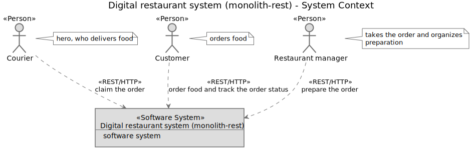
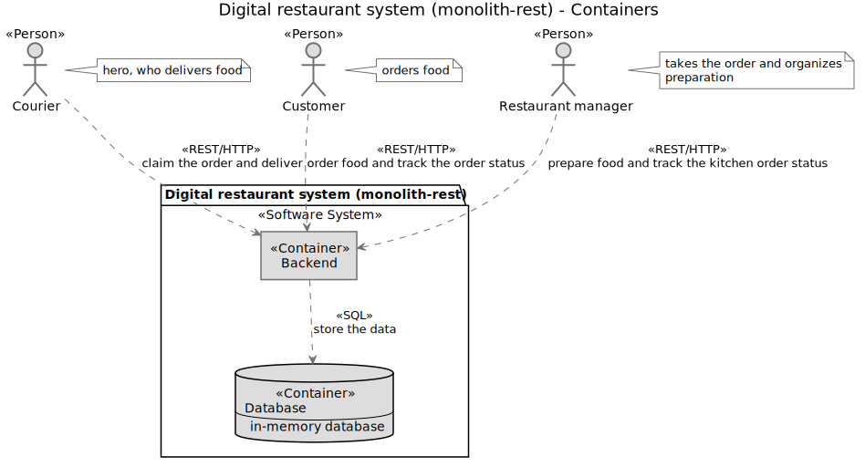
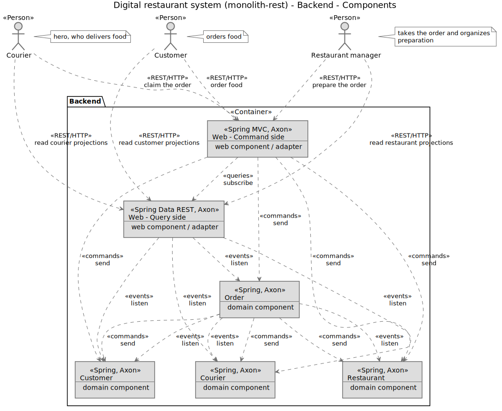

## Monolith 2 (REST API by not segregating Command and Query)
#### :octocat: [digital-restaurant](https://github.com/idugalic/digital-restaurant)/drestaurant-apps/drestaurant-monolith-rest :octocat:

*This is a thin layer which coordinates the application activity. It does not contain business logic. It does not hold the state of the business objects*

*We are utilizing [components from the domain layer](https://github.com/idugalic/digital-restaurant/tree/master/drestaurant-libs). This layer contains information about the domain. This is the heart of the business software.*

Sometimes, you are simply being required to deliver REST API.

A recurring question with CQRS and EventSourcing is how to put a synchronous REST front-end on top of an asynchronous CQRS back-end.

In general there are two approaches:

 - **segregating Command and Query** - resources representing Commands (request for changes) and resources representing Query Models (the state of the domain) are decoupled
 - **not segregating Command and Query** - one-to-one relation between a Command Model resource and a Query Model resource
 
This application is using the second approach ('NOT segregating Command and Query') by exposing capabilities of our 'domain' via the REST API components that are responsible for
 
 - dispatching commands - [CommandController](https://github.com/idugalic/digital-restaurant/tree/master/drestaurant-apps/drestaurant-monolith-rest/src/main/kotlin/com/drestaurant/web/CommandController.kt)
 - querying the 'query model' (materialized views) - [Spring REST repositories](https://github.com/idugalic/digital-restaurant/tree/master/drestaurant-apps/drestaurant-monolith-rest/src/main/kotlin/com/drestaurant/query/repository)


**We create one-to-one relation between a Command Model resource and a Query Model (materialized view) resource.**
Note that we are utilizing Spring Rest Data project to implement REST API, and that will position us on the third level of [Richardson Maturity Model](https://martinfowler.com/articles/richardsonMaturityModel.html)

[Event listener](https://github.com/idugalic/digital-restaurant/tree/master/drestaurant-apps/drestaurant-monolith-rest/src/main/kotlin/com/drestaurant/query/handler) is a central component. It consumes events, and creates Query Model / materialized views of aggregates.
Additionally, it will emit 'any change on Query Model' to Axon subscription queries, and let us subscribe on them within our [CommandController](https://github.com/idugalic/digital-restaurant/tree/master/drestaurant-apps/drestaurant-monolith-rest/src/main/kotlin/com/drestaurant/web/CommandController.kt) keeping our architecture clean.

Although fully asynchronous designs may be preferable for a number of reasons, it is a common scenario that back-end teams are forced to provide a synchronous REST API on top of asynchronous CQRS+ES back-ends.

#### Visualize Your Architecture - C4 model

The [C4 software architecture model](https://c4model.com/) is a simple hierarchical way to think about the static structures of a software system in terms of **containers**, **components** and **classes** (or code).

##### System Context Diagram

A System Context diagram can be a useful starting point for diagramming and documenting a software system, allowing you to step back and look at the big picture.



##### Container Diagram

Once you understand how your system fits in to the overall IT environment with a System Context diagram, a really useful next step can be to illustrate the high-level technology choices with a Container diagram. A "container" is something like a web server, application server, desktop application, mobile app, database, file system, etc. Essentially, a container is anything that can execute code or host data.



##### Component Diagram

Following on from a Container diagram showing the high-level technology decisions, you can then start to zoom in and decompose each container further. However you decompose your system is up to you, but this is about identifying the major logical structural building blocks and their interactions.



#### Restaurant management API

##### Read all restaurants
```
curl http://localhost:8080/restaurants
```
##### Create new restaurant
```
curl -i -X POST --header 'Content-Type: application/json' --header 'Accept: */*' -d '{
"menuItems": [
 {
   "id": "id1",
   "name": "name1",
   "price": 100
 }
],
"name": "Fancy"
}' 'http://localhost:8080/restaurants'
```
##### Mark restaurant order as prepared
```
curl -i -X PUT --header 'Content-Type: application/json' --header 'Accept: */*' 'http://localhost:8080/restaurants/RESTAURANT_ID/orders/RESTAURANT_ORDER_ID/markprepared'

```
#### Customer management API

##### Read all customers
```
curl http://localhost:8080/customers
```
##### Create/Register new Customer
```
curl -i -X POST --header 'Content-Type: application/json' --header 'Accept: */*' -d '{
"firstName": "Ivan",
"lastName": "Dugalic",
"orderLimit": 1000
}' 'http://localhost:8080/customers'
```

#### Courier management API

##### Read all couriers
```
curl http://localhost:8080/couriers
```
##### Create/Hire new Courier
```
curl -i -X POST --header 'Content-Type: application/json' --header 'Accept: */*' -d '{
"firstName": "John",
"lastName": "Doe",
"maxNumberOfActiveOrders": 20
}' 'http://localhost:8080/couriers'
```
##### Courier takes/claims the Order that is ready for delivery (prepared)
```
curl -i -X PUT --header 'Content-Type: application/json' --header 'Accept: */*' 'http://localhost:8080/couriers/COURIER_ID/orders/COURIER_ORDER_ID/assign'
```

##### Courier marks the order as delivered
```
curl -i -X PUT --header 'Content-Type: application/json' --header 'Accept: */*' 'http://localhost:8080/couriers/COURIER_ID/orders/COURIER_ORDER_ID/markdelivered'
```

#### Order management API

##### Read all orders
```
 curl http://localhost:8080/orders
```

##### Create/Place the Order
```
curl -i -X POST --header 'Content-Type: application/json' --header 'Accept: */*' -d '{
"customerId": "CUSTOMER_ID",
"orderItems": [
 {
   "id": "id1",
   "name": "name1",
   "price": 100,
   "quantity": 0
 }
],
"restaurantId": "RESTAURANT_ID"
}' 'http://localhost:8080/orders'
```
 Note: Replace CUSTOMER_ID and RESTAURANT_ID with concrete values.

### Run the application

```bash
$ cd digital-restaurant/drestaurant-apps/drestaurant-monolith-rest
$ mvn spring-boot:run
```


### Infrastructure
- [H2 - java SQL databse][h2]
 

[mvn]: https://maven.apache.org/
[kotlin]: https://kotlinlang.org/
[spring]: https://spring.io/
[axonframework]: https://axoniq.io/
[mysql]: https://www.mysql.com/
[h2]: http://h2database.com/html/main.html